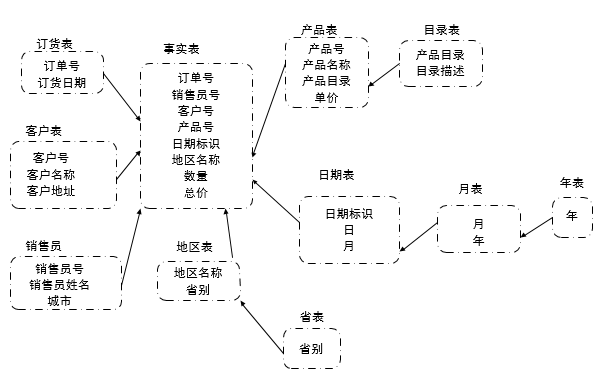

**一文综述-数据仓库**

廖惠琳

**前言**

"20年前查询不到数据,因为数据太少了.20年后的今天还是查询不到数据,因为数据太多了."

为了解决这一问题,人们设想专门为业务的统计分析建立一个数据中心,它的数据从联机的事务处理系统中来、从异构的外部数据源来、从脱机的历史业务数据中来……这个数据中心是一个联机的系统,它是专门为分析统计和决策支持应用服务的,通过他可以满足决策支持和联机分析应用所要求的一切.这个数据中心就叫数据仓库,这个概念在20世纪90年代被提出来.

**1.数据仓库理论基础**

### 1.1数据仓库的定义

数据仓库的概念一经出现,就首先被用于金融、电信、保险等主要的传统数据处理密集型行业.大量组织机构已经发现,在当今这个充满竞争和快速发展的世界中,数据仓库是一个有价值的工具.那么到底什么是数据仓库呢?自从数据仓库概念出现以来,不少学者从不同的角度为数据仓库下了不同的定义.

1.  Informix公司的定义:数据仓库将分布在企业网络中不同信息岛上的业务数据集成到一起,存储在一个单一的集成关系数据库中,利用这种集成信息,可方便用户对信息的访问,更可使决策人员对一段时间内的历史数据进行分析,研究事务发展走势.

2.  SAS软件研究所的定义:数据仓库是一种管理技术,旨在通过通畅、合理、全面的信息管理,达到有效的决策支持.

3.  斯坦福大学数据仓库研究小组的定义:数据仓库是集成信息的存储中心,这些信息可用于查询或分析.

4.  业界公认的数据仓库概念创始人W.H.Inmon在\<\<数据仓库\>\>(Building the Data
    Warehouse)一书中对数据仓库的定义是:数据仓库是面向主题的、集成的、不可更新的(稳定性)、随时间不断变化的数据集合,用以支持经营管理中的决策指定过程.

从上述数据仓库的不同定义中,不难发现它们具有一些共同的特征:

1.  数据仓库中包含大量数据,这些数据可能来自企业或组织内部,也可能来自外部;

2.  以数据仓库方式进行组织的目的是为了能够更好地支持决策;

3.  数据仓库为最终使用者提供了用于存取、分析数据的工具;

总而言之,数据仓库是将原始的操作数据进行各种处理并转换成综合信息,提供功能强大的分析工具对这些信息进行多方位的分析以帮助企业领导做出更符合业务发展规律的决策.

### 1.2数据仓库的特征

从W.H.Inmon关于数据仓库的定义中可以分析出数据仓库具有这样一些重要的特性:面向主题性、集成性、时变性、非易失性、集合性.

1.  面向主题性(Subject-oriented)

主题是与传统数据库的面向应用相对应的,是一个抽象的概念,是在较高层次上将企业信息系统中的数据综合、归类并进行分析利用的抽象.举例来说,销售商将销售数据系统分成零售、批发销售、出口销售等几个子系统,每个系统都支持对数据的基本查询.但是作为销售商,往往需要在所有销售信息上运行一个全局查询,而不是针对某个单一的子系统.这时需要有一个面向主题的数据组织方式,在较高层次上对分析对象进行一个完整、一致的描述,统一地刻画分析对象所涉及的企业各个数据,以及数据之间的联系.每一个主题对应一个宏观的分析领域.数据仓库围绕一些主题,如顾客、供应商、产品和销售组织.数据仓库关注决策者的数据建模与分析,而不是集中于组织机构的日常操作和事务处理.因此数据仓库排除对于决策无用的数据,提供特定主题的简明视图.

1.  集成性(Integrated)

所谓集成性,是指在数据进入数据仓库之前,必须经过数据加工和集成,这是建立数据仓库的关键步骤.因为,通常构造数据仓库是将多个异种数据源(如:关系数据库、一般文件和联机事务处理记录)集成在一起,这些数据即来自企业内部,也可以企业范围以外的某些市场信息.所以,首先要统一原始数据中的矛盾之处,使用数据清洗和数据集成技术,确保命名约定、编码结构、属性度量的一致性;然后再将原始数据结构做一个从面向应用向面向主题的转变.

1.  时变性(Time-variant)

所谓时变性,是指数据仓库中的信息并不只是关于企业当时或某一时点的信息,而是系统地记录了企业从过去某一时点到目前(一般为5\~10年)的数据,主要用于进行时间趋势分析.在数据仓库中,数据保存时限取决于进行决策分析的需要,并且所有数据均需标明所属历史时期.而且数据仓库中的数据是随时间的变化而不断变化的.这一特征主要表现在以下三个方面:首先,数据仓库随着时间变化不断删除旧的数据内容;再者,数据仓库中包含大量的综合数据,这些综合数据中很多跟时间有关.所以这些数据会随着时间的变化不断地进行重新综合.

1.  非易失性(Nonvolatile)

数据仓库总是物理地分离存放数据,这些数据源于操作环境下的应用数据.通常,它只需要两种数据访问:数据的初始化装入和数据访问,而且不能对数据仓库中的细节数据自动进行改动.由于这种分离,数据仓库不需要事务处理、恢复和并发控制机制.所以,细节数据几乎是不进行更新的,而只能进行追加.

这里,必须指出非易失性和时变性之间的区别.非易失性是指作为数据仓库的使用者不能也不应该去改动数据内容,因为这样做会影响统计分析的结果.而时变性则是随着新数据的不断进入,数据仓库中的某些统计变量应该进行相应的调整.当然这种调整是由系统来完成的,对用户而言完全是透明的.

1.  集合性

数据仓库的集合性意味着数据仓库必须以某种数据集合的形式存储起来.目前数据仓库所采用的数据集合方式是以多维数据库方式进行存储的多维模式,以关系数据库方式进行存储的关系模式或以两者结合的方式进行存储的混合模式.

### 1.3数据仓库的用户

从数据仓库的最终用户来看,可以分成信息的使用者和知识的挖掘这两大类型.

1.  信息的使用者

信息的使用者是以一种可以预测的、重复的方式来使用数据库.信息使用者在使用数据仓库之前知道他们要了解什么,常常是每天都对数据仓库进行有规则的数据访问.在访问过程中往往只访问很少的一部分数据,而且对数据的访问常常能够获得结果.信息使用者通常要观察一些概括性数据或聚集数据,很少用到一些元数据或详细数据.从信息使用者的工作性质看,他们往往是一些业务员性质的用户,使用一些预先定义好的查询,在概括性数据上进行运行,执行一些简单的处理.因此适合他们的数据存储模式是星型结构.

1.  知识的挖掘者

知识的挖掘者对数据仓库的使用是不规则的,有时很长时间不适用数据仓库,有时却连续地长时期使用.他们在使用数据仓库中,需要对数据仓库中的海量数据进行挖掘.挖掘的目标可能是:在企业做面对的客户群中哪些客户是企业盈利的客户?这些盈利客户应该具有哪些特征?这些盈利客户在采购过程中常常采购哪些产品?所采购的这些产品间互相有什么关系?知识挖掘这在进行知识的挖掘过程中,常常一无所获,但一次偶然的收获回事数据仓库的巨大投资得到丰厚的回报.知识挖掘者往往是一些专业用户,他们负责管理报告的筹建与分析,在数据仓库的使用中,很少进行预先定义的查询,而是提交一些复杂的、动态的查询,要求数据仓库进行复杂的数据处理.

**2.数据仓库系统结构**

### 2.1数据仓库的数据模型

对于逻辑上的多维度数据模型，可以使用不同的存储机制和表示模式来实现多维数据模型。目前，使用的多维数据模型主要有星型模型、雪花模型、星网模型等。

1.  星型模型

大多数的数据仓库都采用星型模型.星型模型是由事实表(大表)以及多个维表(小表)组成.事实表中存放大量关于企业的事实数据(数量数据),这些数据通常都很大,而且非规范化程度很高,例如,多个时期的数据可能会出现在同一个表里.维表中存放描述性数据,维表是围绕事实表建立的较小的表.

图所示为一个星型模型实例。

事实表有大量的行(记录),然后维表相对来说有较少的行(记录).星型模型存取数据速度快,主要在于针对各个维作了大量的预处理,如按照维进行预先的统计、分类和排序等,如果按照汽车的型号、颜色和代理商进行预先的销售量统计,作报表时速度会很快.

星型模型与完全规范化的关系设计相比较,存在一些显著的差异.

星型模型以潜在的存储空间代价,使用了大量的非规范化来优化速度.规范的关系设计使数据的冗余保持在最少,并减少了当数据改变时系统必须执行的动作.

星型模型限制了事实表上的数量属性个数,然而规范的关系设计能够存储多个与事务相关的数据.

星型模型的缺点:

当业务问题发生变化,原来的维不能满足要求时,就需要增加新的维.由于事实表的主键由所有的维表的主键组成,这种维的变化带来的数据变化将是非常复杂、非常耗时的.

星型模型的数据冗余量很大,不适合于大数据量的情况.

1.  雪花模型

雪花模型是对星型模型的扩展,雪花模型对星型模型的维表进一步层次化,原来的各维表可能被扩展为小的事实表,行程一些局部的”层次”区域.它的优点是最大限度地减少数据存储量,以及吧较小的维表联合在一起来改善查询性能.

雪花模型增加了用户必须处理的表的数量,增加了某些查询的复杂度.但这种方式可以使系统进一步专业化和实用化,同时降低了系统的通用程度.前端工具将用户的需求转换为雪花模型的物理模式,完成对数据的查询.

在雪花模型中能够定义多重”父类”维来描述某些特殊的维表.比如,在时间维上增加了月维和年维,通过查看与时间有关的父类维,能够定义特殊的时间统计信息,如销售月统计、销售年统计等,这样便于DLAP的钻取.

图所示为一个雪花模型实例。

在上面的星型模型数据中,对”产品表”、”日期表”、”地区表”进行扩展,行程雪花模型数据,如上所示,使用数据仓库的工具完成一些简单的二维或三维查询,既满足了用户对复杂的数据仓库查询的需求,又能完成一些简单查询功能而不用访问过多的数据.

1.  星网模型

星网模型是将多个星型模型连接起来行程网状结构.多个星型模型通过相同的维,如时间维,连接多个事实表.

### 2.2数据仓库的开发流程

数据仓库的开发过程可以分为三个大的阶段:数据仓库的规划与分析阶段、数据仓库的设计与实施阶段以及数据仓库的应用阶段.

1.  数据仓库的规划与分析阶段

开发数据仓库之前,首先要进行数据仓库的规划、包括确定数据仓库的开发目标和范围,选择数据仓库的实现策略,选择数据仓库的应用结构和技术平台结构,确定数据仓库的使用方案和开发预算.

规划完成之后,接下来进行数据仓库的需求定义,为数据仓库的分析设计和实施作准备.需求定义包括业主需求的定义、开发者需求定义和最终用户需求定义.

1.  数据仓库的设计与实施阶段

数据仓库的设计与实施是从建立数据仓库的数据模型开始,包括确定数据仓库的数据源,设计数据仓库与业务系统的接口,设计数据仓库的体系结构,数据仓库的数据库设计,数据仓库的中间件的设计,数据仓库数据的抽取、转换与加载,数据仓库数的复制与发行,数据仓库的测试等.

\-数据仓库的概念模型设计

数据仓库的概念模型的设计目的是确定系统主题域,在这项活动中要求系统设计人员多与用户进行广泛的沟通,对他们关心的问题进行分析,了解他们分析问题时的信息需求,再归纳成数据仓库的主题,确定每一个主题的事实表和维度,并使用多维数据模型建立数据仓库的概念模型.

\-数据仓库的逻辑模型设计

在确定主题后,需要对主题包含的信息进行详细定义,并对事实表和维表的关系详细定义.

\-数据仓库的物理模型设计

物理设计主要考虑数据的存储方式,使得系统有较好的性能.对于记录庞大的事实表,可以考虑进行数据分割,分区存放.而记录很少的维表则可以集中存放于某一表空间,甚至可以让其数据在首次读取时驻留在系统内存中,以快速数据存取速度.索引的建立也是在物理设计中完成的,建立适当的索引能提高读取数据的速度.

\-源数据抽取、清洗、整理及装载设计

数据仓库的数据总是来自前台作业系统、业务部门的计划数据、各类广告促销活动及其影响数据,以及购买回来的商业数据库.这些数据并非照搬过来就行,而是要按照前面提到的步骤,以统一定义的格式从各个系统抽取出来,经过清洗,再经过数据装载和整理程序进入数据仓库.

\-数据表达及访问设计

数据按统一格式、不同的主题存放到数据仓库后,下一步要着手进行数据表达及访问的设计.这主要是考虑用户对信息的具体需求,对应采用不同的方式.比如,使用Oracle数据库存放数据,可以用PL/SQL编制报表,也可以用Developer2000或Visual
Basic编制报表,当然也可以采用一些业界优秀的OLAP产品,例如Cognos公司的Transformer,PowerPlay
En-terprise,Oracle公司的Express等.

\-数据仓库维护方案的设计

数据仓库的运作与传统的作业系统有很大区别,它需要不间断地维护,否则它的性能将越来越差.例如,数据访问采用基于代价的优化(CBO),事实表实施时有300万笔记录,一个月后记录数可能增加到3000万个,则最初的CBO根本无法得到现在的最优化存取路径.因此必须设计一个不间断的维护方案,让系统保持优良的性能.

1.  数据仓库的使用阶段

数据仓库使用阶段的工作包括用户的培训与支持,以各种方式使用数据仓库(包括分析处理和数据挖掘),数据仓库中数据的刷新,以及数据仓库的完善与增强等.

### 2.3数据仓库的体系结构

数据仓库是面向主题、面向分析和知识发现的一种数据处理技术,对数据仓库的使用没有固定的模式.数据仓库的数据来源广泛,使用要求多变,查询要求复杂,传统的数据库系统结构无法提供足够的灵活性来满足这种复杂多变的使用要求.因此数据仓库的结构与操作型事务处理系统的机构有很大的不同.

1.  用户眼中的数据仓库结构

对于数据仓库的用户来说,数据仓库系统是由数据源、数据仓库的数据存储、数据仓库的应用工具和可视化用户界面组成的.

数据源的作用是提供原始数据,这些数据一部分来自企业内部的现有信息系统,如管理信息系统、ERP系统等,这些数据源是数据仓库的内部数据源.另外一些原始数据可能来自企业的外部,如专门的调查得到的数据、第三方提供的数据或商品数据库提供的数据等,这些数据源我们称之为外部数据源.数据源是建立数据仓库的基础,否则,数据仓库将成为无源之水,无本之木.因此,企业具有健全和成功应用的管理信息系统是建立数据仓库的关键.

数据源中的数据并不能直接用于进行复杂的分析处理,必须要根据数据仓库的使用要求确定分析的主题数据和各种分析指标,并据此从数据源获得这些数据,将它们进行有效的组织,存储于数据仓库之中,以便进行快速高效的分析.因此数据仓库的数据存储是数据仓库系统的核心部分.数据仓库中的数据一般以多维数据的形式进行组织,采用星型数据模型进行数据存储.数据源中的数据在进入数据仓库的数据存储之前,必须经过抽取、清洗、转换等预处理过程.

存放在数据仓库的数据需要借助各种应用工具来进行分析处理,以便真正发挥作用.目前应用工具主要有联机分析处理OLAP(On-Line
Ana-lytical Processing)和数据挖掘(Data
Mining)两大类.OLAP主要用于支持目标明确但比较复杂的查询分析操作,例如:回答诸如”2004年一季度公司的保健类产品在华东地区的销售额比2013年一季度增长了多少?”这样的问题.而数据挖掘主要用于支持从大量数据中去寻找尚未发现的知识,例如:”购买某种产品的客户具有什么特征?”应用工具是数据仓库系统的重要组成部分,

可视化用户界面的作用是使得数据仓库的用户能够方便直观地与系统进行交互,如:确定分析查询的要求,建立数据挖掘模型,查看分析或数据挖掘的结果,等等.

1.  数据仓库系统的体系结构

著名的数据仓库专家Ralph
Kimball针对数据仓库的具体情况,从数据体系结构、系统体系结构和技术体系结构三个方面来描述数据仓库系统的总体框架.数据仓库的数据体系结构、系统习题结构和技术体系结构回答了数据仓库三个方面的问题,即:数据仓库的内容是什么?基于什么系统平台?采用什么技术实现?

数据仓库体系结构框架的内容如表所示

|                  | **数据体系结构**                                                            | **系统体系结构**                                                                                        | **技术体系结构**                                                               |
|------------------|-----------------------------------------------------------------------------|---------------------------------------------------------------------------------------------------------|--------------------------------------------------------------------------------|
| **商务需求**     | 进行商务分析与决策的信息需求                                                | 对网络环境、软硬件平台的性能要求                                                                        | 如何获得信息? 如何使用信息?                                                    |
| **体系结构模型** | 如何用多维数据模型来表达信息,应该包括哪些事实表和维表?事实表和维表怎样连接? | 选择什么样的网络环境和软硬件平台?数据具体存放在哪里?系统能否满足数据计算、数据存储和数据传递的性能要求? | 如何将原始数据变换成所需的信息,在适当的时间以正确的内容和恰当的格式存储或输出? |
| **实现方法**     | 创建数据库,建立相应的表、索引,进行数据库的维护                              | 安装测试网络环境和软硬件平台                                                                            | 对原始数据进行抽取、清洗、转换和存储、生成分析报告等数据处理结果提供给用户     |

当谈论数据仓库的结构时,人们往往指的是数据仓库的技术体系结构.数据仓库的技术体系结构如下图所示.一个数据仓库系统的技术体系结构总体来说包括后台数据预处理(数据获取)、数据仓库数据管理和数据仓库的前台查询服务(应用服务)三大部分.

数据仓库的技术体系结构如下图所示。

数据仓库中的数据来自企业内部不同的业务系统甚至企业外部的商业数据库,这些数据库对于数据仓库来说被称为数据源.不难理解,数据源中的数据在数据的组织方式、数据格式等许多方面与数据仓库对数据的要求有很大的差别,因此这些数据不可能直接载入数据仓库的数据库中.必须进行数据的预处理工作.数据的预处理包括数据源的定义,从数据源提取数据到预处理数据区(数据准备区),在数据准备区中对数据进行转换处理,再将数据加载到数据仓库等.实现这部分功能的是数据仓库的后台数据预处理部分.

数据仓库的管理包括数据仓库的创建、数据仓库的维护、对数据仓库中数据的重整、数据仓库中元数据管理等.该部分的核心功能是完成数据仓库的建模、确保数据的粒度级别、指定数据仓库的物理存储模式、确保数据仓库的运行效率等.

数据仓库的应用服务部分提供了各种应用工具,使用这些工具可以对数据仓库中的数据进行复杂的查询分析和知识挖掘等.没有一种工具可以满足所有的应用需求,可选择的工具大致可以分为数据挖掘工具、特别查询工具、在线分析工具等.

1.  数据集市

数据集市的概念与数据仓库相似,数据仓库是企业级的,而数据集市一般是为满足某个业务部门进行分析决策的需求而建立的.可以将数据集市理解为部门级的数据仓库.数据集市一般按业务分析领域进行数据组织,一个数据集市往往包含有一个特定业务分析领域的数据,例如销售数据集市、人力资源数据集市、财务数据集市等.

在实际的数据仓库应用中,数据集市可以被设计成独立的数据仓库,也可以被设计成从属于某个主数据仓库.

如果一个数据集市不依赖于中央数据仓库,则该数据集市被成为独立的数据集市.这些数据集市独立地从数据源获取数据,供查询分析使用.在数据仓库的建设过程中,很多时候是先建立数据集市,再由数据集市汇集成一个企业级的数据仓库.Ralph
Kimball曾经撰文提出,数据仓库是数据集市的集合.

独立的数据集市的逻辑结构如下图:

采用独立数据集市来建设企业的数据仓库可能会造成一些问题,如各数据集市中数据的不一致、形成信息孤岛、维护困难等.Bill
Inmon认为通过建立独立的数据集市来构建企业的数据仓库是不合适的.他的著名的比喻是:你可以在大海里抓许多小鱼并堆积起来,但它们成不了一条鲸鱼.

从属于数据仓库的数据集市从数据仓库中获得数据,并根据部门的分析领域和查询性能进行重新组织和优化.采用这种方式建立数据仓库时,要求采用自顶向下的方法,先经过细致的全局规划,以保证各数据集市间和数据仓库中数据的一致性.

从属数据集市的逻辑结构如图:

**3.联机分析处理**

### 3.1联机分析处理的概述

数据仓库的建立为有效利用数据资源帮助进行管理决策奠定了基础,但对数据仓库中的数据进行分析必须要有功能强大的工具的支持.联机分析处理就是一个得到广泛使用的基于数据仓库的数据分析技术.它能够根据分析人员的要求,快速灵活地对大量数据进行复杂的查询处理,并以直观和易于理解的方式提供给使用者.

**3.1.1 OLAP的定义**

联机分析处理OLAP(On-Line Analytical
Processing)是由关系数据库支付E.F.Codd于1992年首先提出来的,其目的是解决如何利用联机事务处理系统产生大量数据为组织的决策提供信息.1993年,E.F.Codd及其同事发表了一份题为”Providing
OLAP(On-Line Analytical Processing) to User-Analysts: An IT
Mandate”的白皮书.在该OLAP白皮书中包括了12条广为人知的准则,1995年又增加了6条,.一般认为,一个好的OLAP产品应该支持这些特性.这些准则包括:

F1: 多维概念视图(原准则1).这一准则被公认为是OLAP的核心.

F2: 直观的数据操纵(原准则10).

F3: 可存取性.OLAP是一种中介(原准则3),位于异构的数据源和OLAP前端工具之间.

F4:
分批提取VS解释(新增).该准则要求OLAP产品既提供自己的中间数据存储能力又可以即时访问外部数据.

F5:
OLAP分析模型(新增).要求OLAP产品支持白皮书中提出的四种分析模型(Categorical,Exegetical,Contemplative
and Formulaic)

F6: 客户/服务器结构(原准则5)

F7:
透明性(原准则2).该准则要求OLAP产品能够让用户从OLAP引擎获得所有的数据而不必知道这些数据究竟来自何处.即用户使用一个带插件的电子表格就可以通过OLAP服务器引擎即时访问异构的数据源.

F8: 支持多用户(原准则8)

F9: 处理非规范化数据(新增)

F10: 保存OLAP结果,且与源数据分离(新增)

F11: 抽取遗漏的数据(新增)

F12: 处理遗漏数据(新增).不管来源何处,遗漏的数据将被OLAP分析器忽略.

F13: 灵活的报表生成能力(原准则11)

F14: 稳定的报表生成性能(原准则4)

F15: 自动调节物理模式的能力(取代原准则7)

F16: 维的等同性准则(原准则6).每一个维在结构上和操作能力上应该是等价的.

F17:
不受限制的维和聚集层次(原准则12).实际上这是不可能的,很少应用需要多于8到10个维,聚集层次一般不会超过6个.

F18: 不受限制的跨维操作(原规则9)

odd将他们划分为四组,其中F1\~F8为基本特性,F9\~F12为特殊特性,F13\~F15为报表特性,F16\~F18为维控制特性.

**3.1.2 OLAP的基本概念**

OLAP是在OLTP的基础上发展起来的,OLTP是以数据库为基础的,面对的是操作人员和底层管理人员,对基本数据进行查询和增删改查等处理.OLAP是以数据仓库为基础的数据分析处理.它有两个特点:一是线性,体现为对用户请求的快速响应和交互式操作,它的实现是由客户/服务器这种体系结构来完成的,二是多维分析,这也是OLAP的核心所在.

OLAP超越了一般查询和报表的功能,它是建立在一般事务操作之上的另外一种逻辑步骤,因此,它的决策支持能力更强.在多维数据环境中,OLAP为终端用户提供了复杂的数据分析功能.通过OLAP,高层管理人员能够通过浏览、分析数据去发现数据的变化趋势、特征以及一些潜在的信息,从而更好地帮助他们了解商业活动的变化.目前,比较普遍接受的OLAP的定义有两种.

OLAP理事会给出的定义

OLAP是一种软件技术,它使分析人员能够迅速、一致、交互地从各个方面观察信息,已达到深入理解数据的目的.这些信息是从原始数据转换过来的,按照用户的理解,它反映了企业真实的方方面面.

企业的用户对企业的观点自然是多维的.拿销售来说,不仅可从生产这方面看,还与地点、时间有关,这就是为什么要求OLAP模型是多维的原因.这种多维用户视图通过一种更为直观的分析模型进行设计和分析.

OLAP的大部分策略都是将关系型的或普通的数据进行多维数据存储,以便于进行分析,从而达到联机分析处理的目的.这种多维数据库,也被看做超立方体,沿着各个维方向存储数据,它允许用户沿事物的轴线方便地分析数据.

OLAP简单定义

近来,随着人们对OLAP理解的不断深入,有些学者提出了更为简要的定义,即联机分析处理是共享多维信息的快速分析,它体现了以下4个特征.

快速性(Fast):
用户对OLAP的快速反应能力有很高的要求.系统应能在5秒内对用户的大部分分析要求做出反应,如果终端用户在30秒内没有得到系统的响应,则会失去分析住线索,影响分析的质量.

可分析性(Analysis):
OLAP系统应能处理与应用有关的任何逻辑分析和统计分析.尽管系统需要一些事先的编程,但并不意味这系统事先已对所有的应用都定义好了.

多维性(Multidimensional):
多维性是OLAP的关键属性.系统必须提供对数据分析的多维视图和分析,包括对层次和多重层次维的完全支持.

信息性(Information):不论数据量有多大,也不管数据存储在何处,OLAP系统应能及时获得信息,并且管理大容量的信息.

用于实现OLAP的技术主要包括客户/服务器体系结构、时间序列分析、面向对象、并行处理、数据存储优化以及多线索技术等.

### 3.2联机分析处理的基本分析操作

OLAP的基本操作主要包括对多维数据进行切片、切块、旋转、钻取等分析操作.这些分析操作使得用户可以从多个角度、多个侧面观察数据库中的数据,从而更加深入地了解包含在数据中的信息.

1.  切片Slicing

切片操作就是在某个或某些维上选定一个属性成员,而在其他维上取一定区间的属性成员或全部属性成员来观察数据的一种分析方式.

如:在时间维上选定成员2002,产品维和地区维取全部属性成员的切片操作.

1.  切块Dicing

切块就是在各个维上取一定区间的成员属性或全部成员属性来观察数据的一种分析方式.可以认为切片是切块的特例,切块是切片的扩展.

如:在时间维上选定成员2001年至2002年,产品维和地区维全部属性成员的切片操作.

1.  钻取Drilling

钻取包含向下钻(Drill-down)和上钻(Drill-up)/上卷(Roll-up)操作.下钻指从概括性的数据出发获得相应的更详细的数据,上钻则相反.钻取的深度与维度所划分的层次相对应.

1.  旋转Pivoting

旋转即改变一个报告或页面显示的维方向.旋转可能包含交换行和列,或是把某一个行维移到列维中去,或把页面显示中的一个维和页面外的为进行交换.

OLAP和OLTP的比较

OLTP称作联机事务处理(On-Line Transaction
Processing),OLAP是继OLTP之后发展起来的一种技术.它们的区别是

1.  OLAP和OLAP产生的背景和目的不同.前者的目的是通过对现有数据进行分析处理,获得信息,支持决策.而后者的目的则是加速对业务数据的处理,支持企业的业务运作.

2.  使用的数据模型不同.OLAP使用的是传统数据模型,而OLAP则使用基于维表和事实表的星型多维数据模型.

3.  数据的综合程度不同

4.  OLAP中的数据不可更改,但需要周期性的刷新,而OLAP中的数据可以更改.

5.  对数据的处理不同.OLTP对数据进行操作型处理,一般运用SQL命令进行追加、删除、修改、简单查询等处理.而OLAP则进行切片、切块、旋转、钻取等分析性处理.

OLAP的新发展—OLAM

OLAM简称”联机分析挖掘”,是将联机分析处理技术(OLAP)和数据挖掘技术(DM)有机地结合起来形成的一种新技术.OLAM兼有OLAP多维分析的在线性、灵活性和DM对数据处理的深入性等特点,因而可在更高层次上满足对信息的分析和筛选要求.

1.  OLAM应该具有的功能特征

一般来说OLAM产品应该具有以下几点特征:

OLAM应具有极大的挖掘能力.借助OLAP的支持,OLAM能挖掘任何需要的数据.

OLAM能提供灵活的挖掘算法选择机制,并提供与外部挖掘算法的通用接口.

OLAM的挖掘算法是基于多维数据模型的,可以和OLAP的操作灵活结合,并具有算法的回溯功能.

基于客户/服务器体系结构,具有较高的执行效率和较快的相应速度,并且能够协调执行效率和挖掘结果的准确性.这主要是指在与用户交互时执行效率要高,而一旦用户选定了挖掘算法和数据空间后,则应保证最终结果的正确性.

OLAM应该具有直观灵活的可视化工具和良好的扩展性.

1.  OLAM的主要发展方向

基于Web的OLAM的体系结构包括浏览器、WWW服务器、OLAM服务器和数据库/数据仓库服务器.一次典型的OLAM数据挖掘过程大致如下:

客户在浏览器端通过表单递交数据挖掘请求至WWW服务器;

WWW服务器调用相应的服务器端应用程序,接受挖掘请求,并将挖掘请求传递给OLAM服务器;

OLAM服务器将挖掘请求解释为具体的挖掘操作与数据库/数据仓库服务器交互完成挖掘过程;

OLAM服务器将挖掘结果传给WWW服务器,WWW服务器将结果生成Web页反馈给浏览器端的用户.

1.  **数据仓库学习资料**

亚马逊链接：

<https://www.amazon.cn/%E8%AE%A1%E7%AE%97%E6%9C%BA%E7%A7%91%E5%AD%A6%E4%B8%9B%E4%B9%A6-%E6%95%B0%E6%8D%AE%E4%BB%93%E5%BA%93-%E8%8D%AB%E8%92%99/dp/B0011BVDHG/ref=sr_1_1?ie=UTF8&qid=1490872757&sr=8-1&keywords=%E6%95%B0%E6%8D%AE%E4%BB%93%E5%BA%93>

<https://www.amazon.cn/%E5%9B%BE%E4%B9%A6/dp/B00RT6LB9W/ref=sr_1_2?ie=UTF8&qid=1490872757&sr=8-2&keywords=%E6%95%B0%E6%8D%AE%E4%BB%93%E5%BA%93>

<https://www.amazon.cn/dp/B007IQMYV2/ref=sr_1_11?ie=UTF8&qid=1490872757&sr=8-11&keywords=%E6%95%B0%E6%8D%AE%E4%BB%93%E5%BA%93>

<https://www.amazon.cn/%E5%9B%BE%E4%B9%A6/dp/B00GXV27Q0/ref=sr_1_1?ie=UTF8&qid=1490872938&sr=8-1&keywords=hive>
